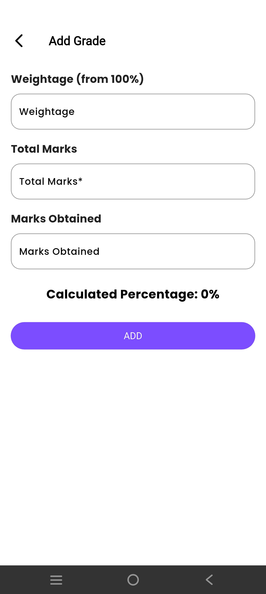

# 📚 StuBuddy  

StuBuddy is a **student management application** designed to simplify college life by bringing all essential academic tools into one app. From timetables to attendance, notes, and events — everything is managed seamlessly.  

---

## 🎓 Motivation Behind Developing This Application  

As students, we often face challenges in managing academics effectively — from keeping track of timetables to maintaining attendance, notes, and events. Most of the time, information gets scattered across different platforms, making it hard to organize and access when needed.  

**StuBuddy** solves this problem by providing all essential student management tools in one place, helping students stay organized and stress-free.  

---

## ❓ Why StuBuddy?  

Other apps like Google Calendar, WhatsApp, or Drive help in certain areas, but **StuBuddy** is tailored specifically for students with unique features such as:  

- Timetable & Attendance Management  
- Attendance Analytics (graphs, trends, best day, etc.)  
- Calendar & Event Tracking  
- Class Reminders & Notifications  

StuBuddy provides these services for **free** and is designed purely for student productivity.  

---

## 🛠 Built With  

StuBuddy is currently developed for **Android** and will be extended to iOS in the future. Contributions are welcome!  

Technologies used in this project:  

- [Flutter](https://flutter.dev/) (Dart)  
- [GetX](https://pub.dev/packages/get) (State Management)  
- [SQLite](https://www.sqlite.org/) (Database Integration)
- [Figma](https://www.figma.com/) (Design)  
- [Firebase](https://console.firebase.google.com) (Backend)  
- Material Design  
- Charts & Analytics  

---

## ⭐ Features  

- 🔔 **Upcoming Classes** – Auto-fetch classes for the current day 
- 📅 **Smart Timetable** – Create and manage weekly class schedules
- 📝 **ToDo List** – Organize tasks, set priorities, and stay on top of assignments & deadlines   
- 🎯 **Attendance Tracking** – Mark attendance, add notes, and view attendance history  
- 📊 **Analytics Dashboard** – Visualize attendance trends with graphs and insights  
- 🗓 **Calendar & Events** – Add college events, deadlines, and reminders  
- ✨ **User-friendly UI** – Simple, modern interface designed for students  
- 📚 **MyGrades** – Track subject-wise marks, calculate GPA/CGPA, and monitor academic progress
- 💵 **Split Bill** – Easily divide expenses among friends, calculate shares, and settle balances
- 📱 **Cross-platform** – Android supported, iOS support coming soon
 
---

## ⬇️ Download

You can download the most recent version of StuBuddy at [StuBuddy.app/download](https://drive.google.com/file/d/1raza-IKWBuDR7rZXbksDtwlJq7gcuXCy/view?usp=drivesdk)

---

## 📸 Screenshots  

### Create Account 

  
  
  

 

### Home Screen 

  

 

### Timetable Screen  

  
  

 

  
  

 

### ToDo List

  
  
  

 

  
  

 

### Attendance Tracking   

  
  
  

 

### Split Bill  

  
  
  

 
  
### Calendar & Events  

  
  

 

### MyGrades

  
  
  

 

### Profile

  
  

 

---
